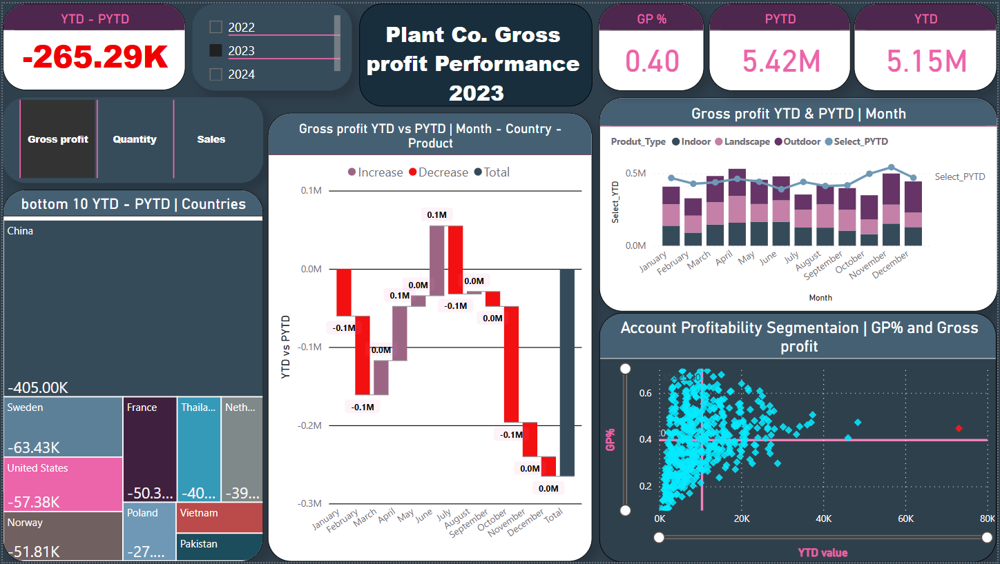
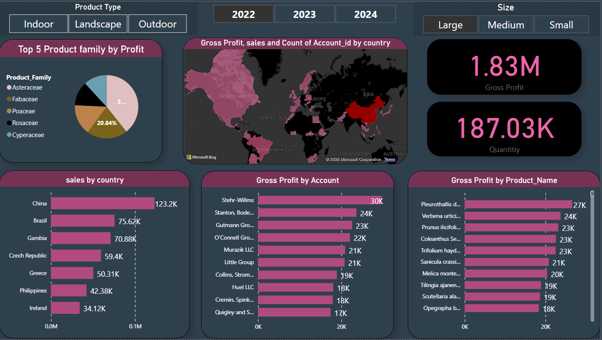

# 🌿 PlantCo – Gross Profit & Sales Performance Dashboard (Power BI)

## 📷 Screenshots

---

This Power BI dashboard project analyzes **gross profit trends**, **account performance**, and **product profitability** over **3 years** for PlantCo.  
It delivers actionable insights with dynamic visuals and smart segmentation.

---

## 📊 Page 1: Gross Profit Performance

### 🔹 YTD vs PYTD
- Tracks Year-To-Date (YTD) vs Previous YTD (PYTD) gross profit.
- Indicates a decline in profitability compared to the previous year.

### 🔹 Monthly & Product Trends
- Sharp drops in **February** and **July**.
- Strong performance in **October** and **November**.
- Products like **Indoor**, **Outdoor**, and **Landscape** show clear seasonality.

### 🔹 Country-Level Insights
- **China** shows the most significant drop in profit.
- Other declining countries: **Sweden**, **USA**, **Vietnam**, **Pakistan**, **Poland**.

### 🔹 Account Segmentation
- Scatter plot visualizes accounts by **Gross Profit %** and **YTD Profit**.
- Most accounts are clustered at low margin, indicating optimization potential.

---

## 📊 Page 2: Sales & Profit Breakdown

### 🔹 Top Product Families
- Leading families: **Rosaceae**, **Asteraceae**, **Fabaceae**, **Poaceae**, **Cyperaceae**.

### 🔹 Sales by Country
- **China** has the highest sales volume.
- Other high-sales countries: **Brazil**, **Gambia**, **Greece**, **Philippines**, **Ireland**.

### 🔹 Best Performing Accounts
- **Stork-Willims** ranks #1 in gross profit.
- Followed by **Stanton**, **Bode**, and **Murazik LLC**.

### 🔹 Most Profitable Products
- **Pleurothallis d.** leads in profit.
- Others include: *Verbena urticifolia*, *Prunus ilicifolia*, *Sanicula crass*, *Opegrapha b.*

---

## 🧠 KPIs Tracked

- **Total Gross Profit**
- **Quantity Sold**
- **Geo Analysis** using a World Map
- **Dynamic Filters**: by Product Type, Size, Year

---

## ⚙️ Features

- Responsive performance even with large datasets.
- Offline-friendly.
- Smart DAX calculations.
- Clean, interactive layout.

---

## 🧑‍💻 Author

**Ayman Reda Mansour**  
[LinkedIn Profile](https://www.linkedin.com/in/ayman-reda-a0808629b/)

---

